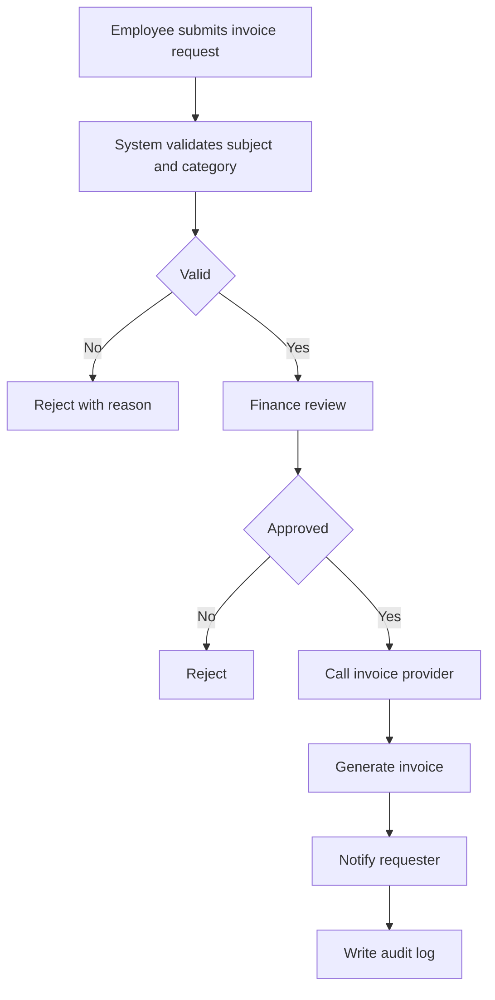

# SPEC Contract Guide

## Core Definition

SPEC is a contract, not a manual.

It defines the target, roles, scope, business flow, rules, boundaries, and acceptance standard that humans and AI must satisfy. It answers:

- What must be true?
- Who is involved?
- What is included and excluded?
- What business rules cannot be violated?
- What counts as accepted?

SPEC does not explain how the current code works, how to run the project, every API field, every database column, every test case, or every deployment command.

Use the strongest boundary:

> If AI getting it wrong would make the business result wrong, put it in SPEC. If AI only needs to read it to implement, put it in another document and reference it from SPEC.

## Three Placement Questions

Ask these before putting content in SPEC:

1. Does this define requirement, rule, boundary, or acceptance standard?
   - Put it in SPEC.
2. Does this explain current code, folders, startup, local development, or how the project is organized?
   - Put it in `README.md`, `DEVELOPMENT.md`, or architecture docs.
3. Does this describe detailed API fields, database tables, deployment commands, or test case details?
   - Put it in `API.md`, `DATA_MODEL.md`, `DATABASE.md`, `DEPLOYMENT.md`, or `TESTING.md`.

## Two Valid SPEC Levels

### Project or Feature SPEC

Usually lives in:

```text
project/docs/SPEC.md
project/docs/FEATURE_X_SPEC.md
```

It is business-specific. It should define what this system or feature must accomplish and what counts as correct.

### Company or Common SPEC

Usually lives in:

```text
comm/
common/
saleforteai-spec/
```

It is reusable across projects. It should define shared rules and guardrails such as UI principles, auth and permission rules, audit rules, API shape, engineering documentation standards, security scanning, or testing standards.

Do not turn one feature's temporary choices into a company-level SPEC. First separate reusable rules from project-specific details.

## What Belongs in SPEC

### Business Goal

Put the reason the system or feature exists in SPEC. AI must know why the work matters or it will implement surface behavior.

```md
## Business Goal

This system supports internal invoice application, review, issuing, query, and audit. It reduces manual invoicing work, lowers wrong-invoice risk, and allows approved business systems to submit invoice requests through API.
```

### User Roles and Scenarios

Roles decide permissions, pages, flows, and data boundaries.

```md
## Roles

- Employee: submits invoice requests and views their own request records.
- Finance reviewer: reviews or rejects invoice requests.
- Admin: maintains invoice subjects, tax categories, and API keys.
- External business system: submits invoice requests through API.
```

### Functional Scope and Non-Goals

SPEC must say what is included and what is not.

```md
## Scope

Must include:
- Invoice request.
- Finance review.
- Invoice issuing.
- Invoice query.
- Audit trail.
- API access.

Not included in this phase:
- Electronic contract management.
- Automatic tax filing.
- General ledger.
- Complex BI analysis.
```

### Business Flow

Flow belongs in SPEC because it defines business correctness.



### Business Rules

Rules that AI must keep obeying belong in SPEC.

```md
## Business Rules

- Each company subject can issue invoices only for configured categories.
- Employees can view only invoice requests they submitted.
- Invoice requests above 100,000 must receive manual review.
- Issued invoices cannot be physically deleted; they can only be reversed.
- Review, rejection, issuing, and reversal must write audit logs.
```

### Permission Boundaries

Put permission principles in SPEC. If the matrix is complex, reference a separate permission document.

```md
## Permission Principles

- Normal users can access only their own data.
- Finance roles can view all invoice requests.
- Admins can maintain subjects, categories, and API credentials.
- External systems can access only APIs authorized by their API key.

Detailed matrix: `PERMISSION_MATRIX.md`.
```

### Data Objects and Data Boundaries

SPEC can name core objects and data boundaries. It should not contain full table definitions.

```md
## Data Objects

Core objects:
- Invoice request.
- Company subject.
- Invoice.
- Review record.
- Audit log.

Detailed fields: `DATA_MODEL.md`.
```

### API Capability Requirements

SPEC can name required API capabilities. It should not contain the full request and response field table.

```md
## API Requirements

The system must provide APIs for creating invoice requests, querying requests, cancelling allowed requests, and receiving provider callbacks.

Detailed API contract: `API.md`.
```

### Non-Functional Requirements

Put requirement-level non-functional rules in SPEC. Put detailed procedures in specialized docs.

Examples:

- All APIs must verify login state or API key.
- Sensitive fields must not be displayed in plaintext.
- Key interfaces should respond within 2 seconds under agreed load.
- Third-party API failures must be logged.
- Test and production environments must be isolated.

### Acceptance Criteria

Acceptance is one of the main reasons SPEC exists.

```md
## Acceptance Criteria

- Employees can submit a complete invoice request.
- Invalid invoice categories are blocked.
- After finance approval, the system can call the invoice provider.
- After successful issuing, the requester can view the invoice download link.
- All key operations have audit logs.
- API failures produce visible errors and retry handling.
```

### Don't List

SPEC should say what humans and AI must not do.

Examples:

- Do not bypass existing permission checks.
- Do not store unnecessary sensitive data.
- Do not physically delete issued invoices.
- Do not treat provider callback success as user-visible success before local state is updated.

## What Does Not Belong in SPEC

### Startup Commands

Put commands in `README.md` or `DEVELOPMENT.md`, not SPEC.

```bash
pnpm install
pnpm dev
docker compose up -d
```

### Full API Field Tables

SPEC may say which API capabilities are required. Detailed paths, fields, error codes, examples, and auth headers belong in `API.md`.

### Database Table Structures

SPEC may list core objects and data boundaries. Full SQL, indexes, constraints, and migrations belong in `DATA_MODEL.md`, `DATABASE.md`, or migration files.

### Code Implementation Plan

SPEC should not say:

```text
Use XxxController to call YyyService, then call ZzzRepository.
```

Unless a layering rule is itself a required architecture constraint, implementation belongs in `ARCHITECTURE.md`, `DEVELOPMENT.md`, Plan, or Tasks.

SPEC should say the result-level rule:

```md
Invoice requests must be processed through the backend service layer. Frontend pages must not call the third-party invoice provider directly.
```

### Test Commands and Test Case Details

SPEC contains acceptance standards. `TESTING.md` contains test strategy, commands, cases, fixtures, and regression procedures.

### Deployment Commands

Deployment steps, environment variables, rollback, and operations belong in `DEPLOYMENT.md`.

### Temporary Discussion and Detailed Change History

Do not dump meeting notes, discarded ideas, or chat conclusions into SPEC. Use `DECISIONS.md`, `notes/`, or `CHANGELOG.md` when needed.

## Recommended Document Layers

```text
README.md                         # What this project is, how to run briefly, where docs live

docs/
  SPEC.md                         # Contract: what to build and what counts as correct
  ARCHITECTURE.md                 # Architecture: modules, dependencies, technical choices
  API.md                          # API contract: paths, fields, errors, auth
  DATA_MODEL.md                   # Data model: entities, fields, relationships
  TESTING.md                      # Test strategy, commands, cases, fixtures
  DEPLOYMENT.md                   # Environments, deployment, rollback
  CHANGELOG.md                    # Change history
  DECISIONS.md                    # Key decisions and rationale

common/ or comm/
  INTERNAL_UI_DESIGN_SPEC.md      # Company-level UI rules
  AUTH_AND_PERMISSION_SPEC.md     # Company-level auth and permission rules
  AUDIT_AND_LOGGING_SPEC.md       # Company-level audit and logging rules
  API_STANDARD.md                 # Company-level API rules
  DOCUMENTATION_STANDARD.md       # Documentation rules and ownership
```

## Boundary Table

| Content | SPEC | README | ARCHITECTURE | API | DATA_MODEL | TESTING | DEPLOYMENT |
| --- | --- | --- | --- | --- | --- | --- | --- |
| System goal | Yes | Brief | No | No | No | No | No |
| User roles | Yes | Brief | No | No | No | Reference | No |
| Scope and non-goals | Yes | Brief | No | No | No | Reference | No |
| Business flow | Yes | No | Reference | No | No | Reference | No |
| Business rules | Yes | No | No | No | No | Reference | No |
| Permission principles | Yes | No | Reference | Reference | No | Reference | No |
| Detailed API fields | Summary/reference | No | No | Yes | No | No | No |
| Database tables | Summary/reference | No | Reference | No | Yes | No | No |
| Technology choices | Constraint-level only | No | Yes | No | No | No | No |
| Startup commands | No | Yes | No | No | No | Brief | No |
| Test commands | No | Brief | No | No | No | Yes | No |
| Deployment commands | No | Brief | No | No | No | No | Yes |
| Acceptance criteria | Yes | No | No | No | No | Detailed validation | No |
| Change history | No | No | No | No | No | No | No |

Change history usually belongs in `CHANGELOG.md`.

## Practical Mnemonic

Put in SPEC:

> Goal, roles, scope, flow, rules, boundaries, acceptance.

Do not put in SPEC:

> Commands, full fields, code paths, logs detail, deployment steps, temporary discussion.

## Project or Feature SPEC Template

```md
# XXX SPEC

## 1. Background

Why this system or feature is needed. What business problem exists now.

## 2. Goals

- Goal 1
- Goal 2
- Goal 3

## 3. Non-Goals

This phase does not include:
- Non-goal 1
- Non-goal 2

## 4. User Roles

| Role | Description | Core permissions |
| --- | --- | --- |
| Normal user | ... | ... |
| Admin | ... | ... |

## 5. Core Scenarios

### Scenario 1: xxx

The user wants xxx, so the system must xxx.

### Scenario 2: xxx

...

## 6. Business Flow

Describe the main flow in text or mermaid.

## 7. Functional Specification

### 7.1 Function A

Must support:
- ...
- ...

Must not:
- ...
- ...

### 7.2 Function B

...

## 8. Business Rules

- Rule 1
- Rule 2
- Rule 3

## 9. Permission and Security

- ...
- ...

Detailed permission matrix: `PERMISSION_MATRIX.md`.

## 10. Data Objects and Boundaries

Core objects:
- Object A
- Object B
- Object C

Detailed fields: `DATA_MODEL.md`.

## 11. API Capability Requirements

The system must provide:
- Create xxx.
- Query xxx.
- Update xxx.
- Receive xxx callback.

Detailed API contract: `API.md`.

## 12. Non-Functional Requirements

- Security:
- Performance:
- Audit:
- Availability:
- Maintainability:
- Observability:

## 13. Acceptance Criteria

- [ ] Criterion 1
- [ ] Criterion 2
- [ ] Criterion 3

## 14. Not Allowed

- Do not ...
- Do not ...
- Do not ...

## 15. Related Documents

- API details: `API.md`
- Data model: `DATA_MODEL.md`
- Testing details: `TESTING.md`
- Deployment details: `DEPLOYMENT.md`
```

## Company or Common SPEC Shape

A common SPEC should standardize repeated rules, not one project's business detail.

Use this shape:

1. Purpose: what drift or repeated mistake this prevents.
2. Scope: which systems or scenarios must follow it.
3. Non-scope: where it must not be applied.
4. Rules: concrete reusable rules.
5. Boundaries: what this standard does not own.
6. References: which detailed docs own fields, commands, examples, or procedures.
7. Acceptance/checklist: how humans and AI verify compliance.
8. Not allowed: common mistakes.

Avoid adding company-level SPECs for unaccepted prototype details, one-off client exceptions, or personal technology preferences.

## Coach Behavior

When a user asks for SPEC:

1. Identify whether they need a project/feature SPEC or a company/common SPEC.
2. Keep SPEC at the contract level.
3. Move implementation, fields, commands, test cases, and deployment details to the right document.
4. If the feature involves UI, workflow, operations, or states, check whether a quick HTML prototype has validated the flow.
5. Before Plan, verify the SPEC has goals, roles, scope, non-goals, rules, boundaries, and acceptance.

Do not write a complete SPEC by default unless the user explicitly asks for a draft. Prefer prompts and review checklists.

## Draft Project SPEC Prompt

```text
请为下面工作生成一份 SPEC 草稿。

注意：
SPEC 是合同，不是 README、技术方案、API 文档、数据库文档、测试文档或部署文档。
请只定义目标、角色、范围、流程、规则、边界和验收。

输入材料：
1. 业务背景：[填写]
2. prototype 或流程材料：[填写，没有则写无]
3. 目标用户/角色：[填写]
4. 当前想达成的业务目标：[填写]
5. 已确认必须做的范围：[填写]
6. 已确认不做的范围：[填写]
7. 权限/安全/数据边界：[填写]
8. 相关公司级/公共 SPEC：[填写，没有则写无]
9. 已有 API / DATA_MODEL / TESTING / DEPLOYMENT 文档：[填写，没有则写待补]

请输出：
1. 背景
2. 目标
3. 非目标
4. 用户角色
5. 核心场景
6. 业务流程
7. 功能规格
8. 业务规则
9. 权限与安全
10. 数据对象与数据边界摘要
11. API 能力要求摘要
12. 非功能要求
13. 验收标准
14. 不允许做的事
15. 需要另行维护的文档引用

不要写：
- 启动命令
- 完整 API 字段表
- 数据库建表 SQL
- 具体代码实现路径
- 测试命令和测试用例细节
- 部署命令
- 一次性讨论记录

特别提醒：
以需求为中心，不要被技术偏好或历史实现绑架。
做加法前先做减法。
如果内容需要展开，请只标记应进入 API.md / DATA_MODEL.md / TESTING.md / DEPLOYMENT.md / README.md / ARCHITECTURE.md，不要在 SPEC 里展开。
```

## Review SPEC Prompt

```text
请审查下面 SPEC 是否合格。

判断标准：
SPEC 是合同，不是说明书。它应该只定义目标、角色、范围、流程、规则、边界和验收。

请检查：
1. 是否有清楚的业务目标。
2. 是否有用户角色和核心场景。
3. 是否有做什么和不做什么。
4. 是否有业务流程和业务规则。
5. 是否有权限、安全、数据边界。
6. 是否有可验证的验收标准。
7. 是否把启动命令、完整 API 字段、数据库表结构、代码实现、测试命令、部署命令或临时讨论错误放进 SPEC。
8. 哪些内容应该移到 README / ARCHITECTURE / API / DATA_MODEL / TESTING / DEPLOYMENT / CHANGELOG / DECISIONS。
9. 是否可以进入 Plan；如果不能，缺什么。

SPEC 内容：
[粘贴]
```

## Common SPEC Impact Prompt

```text
请判断下面内容是否值得沉淀为公司级/公共 SPEC。

注意：
公司级/公共 SPEC 只沉淀可复用规则，不沉淀单次需求细节。
不要写完整规范，不要写技术方案，不要拆任务。

输入材料：
1. 当前项目或功能 SPEC：[粘贴]
2. prototype / 实现结果 / QA 发现：[填写]
3. 已有公共 SPEC 清单：[填写]
4. 已确认的业务结论：[填写]

请输出：
1. 可复用规则有哪些。
2. 本次特例有哪些，不能进入公共 SPEC。
3. 应该更新哪个已有 SPEC，还是新增 SPEC。
4. 最小变更范围。
5. 哪些详细内容应留在项目 SPEC、API、DATA_MODEL、TESTING 或 README。
6. 项目 AGENTS.md / CLAUDE.md / README.md 是否需要补引用。
7. 审查清单。

特别自检：
- 有没有把单次业务需求写成公司级规范？
- 有没有把技术偏好或历史实现固化成规范？
- 有没有先做减法？
- 有没有造成 SPEC、README、API、TESTING 等文档重复维护？
```
